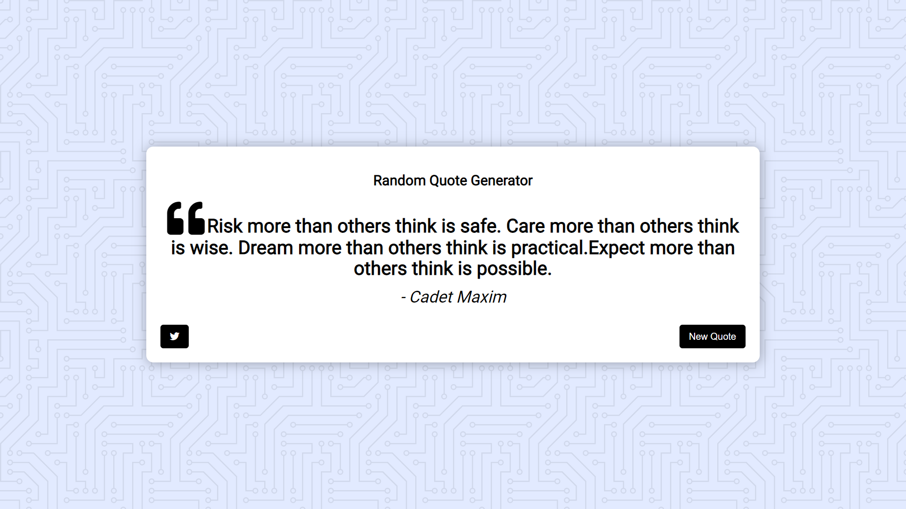

# Quote-Generator
This project is about generating a random quote, from an API, on click of a button. And one can directly tweet that quote via tweet button provided.

# Output

# Motivation for this project
The idea came about from the <a href="https://github.com/zero-to-mastery/javascript20-projects">JavaScript Web Projects: 20 Projects to Build Your Portfolio</a> Course. I encourage you to check it out.

# My Method to learn
I first tried to code myself without watching videos, just saw the design and what is to be done. Therefore you will see my code slightly different from that in actual.
IT WORKED!
Then I watched the videos and made changes that were needed to make code more short and perfect.

# Support
If you find my own code helpful do support by giving it a star or forking it.

# Live
<a href="https://abhishekrawat22.github.io/Quote-Generator/">Visit</a>
